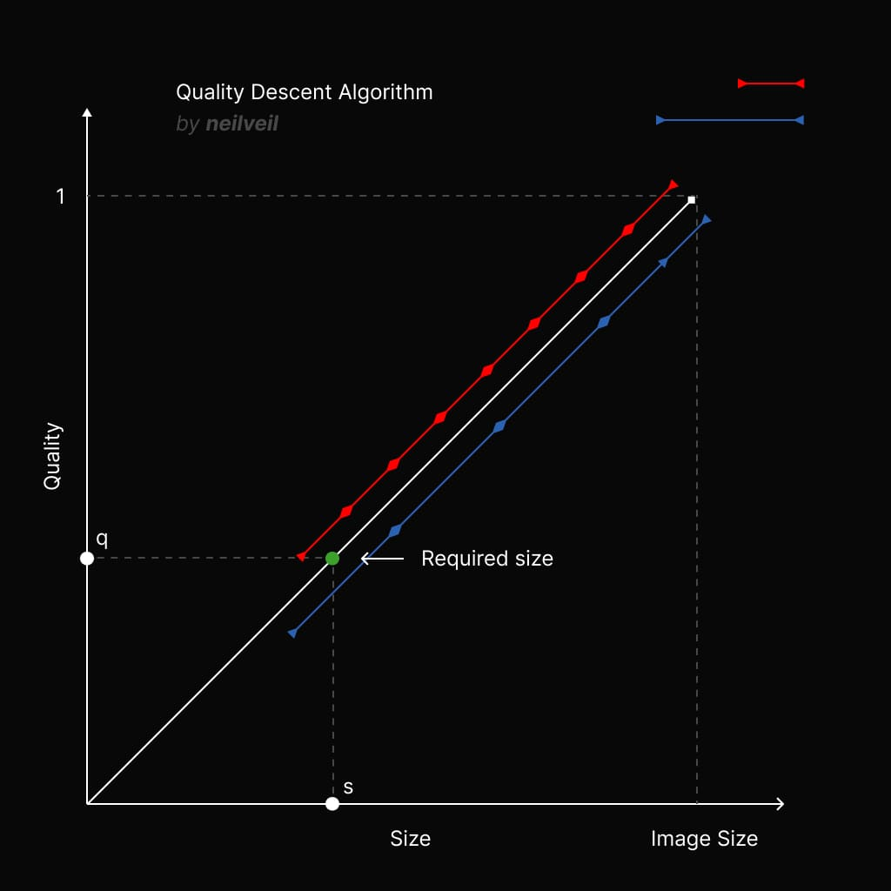

# ✨ Compression Loop ✨


Compression Loop allows you to optimally compress images in the browser to the target size. This package utilizes an iterative approach called **Quality Descent**, to find the optimal balance between image quality and file size.

The **Quality Descent Algorithm** is utilized in the package which finds the optimal quality index to compress the image to the target size.



## Features 🌟

- **In-Browser Image Compression**: Seamlessly compress images directly within the web browser, enabling efficient image optimization without the need for server-side processing.

- **Customizable Target Image Size**: Specify precise target image sizes to align with your application's specific demands, ensuring optimal file size management.

- **Progress Callback Support**: Monitor the compression progress with the built-in callback feature, allowing you to track and display compression status to users for a more interactive experience.

- **Lightweight and Dependency-Free**: Developed with a focus on efficiency, the package is incredibly lightweight, with a file size of less than 1 kilobyte, and operates independently without any external dependencies.

- **Client-Side Processing**: By shifting the image compression workload to the client side, this package reduces the strain on server resources, resulting in significant time and resource savings.

## Installation 🚀

To install the Compression Loop package, you can use npm:

```bash
npm install compression-loop
```

## Usage 🛠️

Here's a basic example of how to use Compression Loop to compress images:

```jsx
const compressionLoop = require('compression-loop');

..

<input
  type='file'
  accept='image/jpeg'
  onChange={async (e) => {
    const img = e.target.files[0]

    const { status, compressedImg } = await CompressionLoop({ img })

    if (status === 'success') {
      console.log('Image compressed', compressedImg)
    } else console.log(status)
  }}
/>
```

| Argument     | Type     | Usage                                    |
|--------------|----------|------------------------------------------|
| *img         | Blob     | Source image                             |
| *maxSize     | Number   | Max allowed size in bytes                |
| onProgress   | Function | Track progress                           |
| timeout      | Number   | Max processing time in milliseconds      |
| maxIteration | Number   | Max compression iterations               |
| quality      | Number   | Starting quality index (0-1], default: 1 |
| descentIndex | Number   | Quality decrement rate, default: 0.1     |

## License 📜

This package is open-source and available under the MIT License.

## Contributing 🙌

Contributions to the Compression Loop package are welcome! If you have any ideas, improvements, or bug fixes, please submit a pull request or open an issue.

## Authors 🖋️

Developed & maintained by [neilveil](https://github.com/neilveil)
